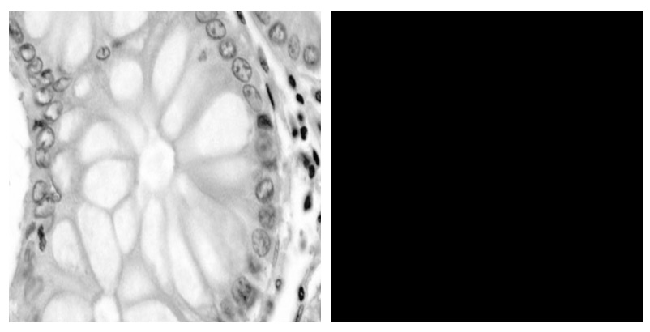

# Introduction

The objective of this project is to exploit and use artificial vision techniques for the recognition and classification of images of colon tissues, distinguishing between benign tissues and those affected by adenocarcinoma. Colon adenocarcinoma is one of the most common forms of colorectal cancer. The current cancer detection method is quite time-consuming and expensive. Pathologists must learn to recognize tissues by studying labeled histopathological images. As a result, a significant amount of resources and manual labor is required. Therefore, automating this analysis through computer vision techniques represents a significant opportunity to improve diagnostic accuracy and efficiency.

The project is divided into two main approaches:

- **Traditional Computer Vision Techniques**: These techniques include the use of classical image processing methods for feature extraction. These features can then be used to train classifiers such as Support Vector Machine (SVM) or Random Forest, in order to distinguish between benign and malignant tissues.

- **Neural Networks**: Convolutional neural networks (CNN) represent the state of the art in image recognition and are particularly effective in classifying medical images. Neural networks can automatically learn the relevant features of images, without the need to extract them manually.

The main objective of the project is to compare the effectiveness and accuracy of the two approaches, evaluating their performance in terms of precision, accuracy, and processing time.

# Dataset

A dataset available on the Kaggle platform was used to develop the project. The dataset in question, accessible at the URL [Lung and Colon Cancer Histopathological Images](https://www.kaggle.com/datasets/andrewmvd/lung-and-colon-cancer-histopathological-images/data), contains 25,000 histopathological images belonging to 5 different classes. All images have a size of 768 x 768 pixels and are in *jpeg* format. The images were generated from a sample of validated and Health Insurance Portability and Accountability Act (HIPAA) compliant sources. The dataset is composed of:

- 750 total images of **lung tissue**:
    - 250 benign lungs
    - 250 lung adenocarcinomas
    - 250 squamous cell carcinomas of the lung

- 500 total images of **colon tissues**:
    - 250 benign colon
    - 250 colon adenocarcinomas

The dataset was subsequently expanded by a factor of **20** using *data augmentation* techniques ([Augmentor](https://github.com/mdbloice/Augmentor)), thus obtaining 25,000 images. For each histopathological image, 20 different images were generated.

The dataset contains images belonging to 5 different classes, each with 5,000 images:

- Benign lung tissue
- Lung adenocarcinoma
- Squamous cell lung cancer
- Adenocarcinoma of the colon
- Benign colon tissue

The objective of the project is to classify images relating to colon tissues. Consequently, images relating to lung tissues were ignored. The dataset used, therefore, considering only the images relating to colon tissues, contains 10,000 images belonging to two classes:

- Adenocarcinoma of the colon
- Benign colon tissue


# Image Analysis

## Color Histogram

A **color histogram** is a representation of the distribution of colors in an image. The histogram is obtained by quantizing each color space channel into a number of bins and counting how many pixels in the image have a certain color.

After calculating the average color histogram for each of the two classes based on all images in the dataset, it can be noted that there is no substantial difference between them. However, a higher frequency is observed in the blue channel of images relating to benign tissues compared to non-benign tissues, where lower frequency values are observed. 

In Figure [1](#fig:color_hist_200), you can compare the color histograms of the two classes, calculated using 200 bins. In Figure [2](#fig:color_hist_50), you can compare the color histograms of the two classes, calculated using 50 bins.

<figure>
    
To compare images based on color histograms, two metrics were used:

- **Correlation**: Quantifies the similarity between two histograms. Values close to 1 indicate high similarity, while values close to 0 indicate little or no similarity. It is calculated as:

   ```math
  d(H_1, H_2) = \frac{\sum_I (H_1(I) - \overline{H}_1)(H_2(I) - \overline{H}_2)}{\sqrt{\sum_I (H_1(I) - \overline{H}_1)^2 \sum_I (H_2(I) - \overline{H}_2)^2}}
   ```

- **Intersection (Similarity)**: Measures the common area of the histograms, quantifying the degree of overlap between them. It is calculated as:

   ```math
  d(H_1, H_2) = \sum_I \min(H_1(I), H_2(I))
   ```

In Table [1](#tab:color_histogram_metrics), you can see the correlation and intersection values calculated between the histograms of the two classes using 200 bins on 500 images per class.

<div id="tab:color_histogram_metrics">
<p align="center">

| Channel | Correlation | Intersection |
|---------|-------------|--------------|
| Red     | 0.9941      | 0.9640       |
| Blue    | 0.9179      | 0.8263       |
| Green   | 0.9182      | 0.8828       |

Correlation and intersection values calculated between the histograms of the two classes using 200 bins on 500 images per class.
</p>
</div>

## Color Moments

**Color moments** are widely used color descriptors for their simplicity and effectiveness in capturing information about the distribution of colors in an image. They allow describing the spatial distribution of colors and are invariant with respect to geometric and scale transformations of the image, which makes them robust in different contexts. Color moments are based on the assumption that the distribution of colors in an image can be interpreted as a probability distribution, characterized by a certain number of moments that describe the image.

Three color moments were used, calculated globally across the entire image:

- **Mean**: Average color in the image.
  Calculated as:
  
   ```math
  \frac{1}{N} \sum_{i=1}^{N} x_i
   ```

- **Standard deviation**: Square root of the variance of the color distribution.
  Calculated as: 
  
  ```math
  \sqrt{\frac{1}{N} \sum_{i=1}^{N} (x_i - \text{mean})^2}
  ```

- **Skewness**: Measures the skewness of the color distribution.
  Calculated as:
  
   ```math
  \sqrt[3]{\frac{1}{N} \sum_{i=1}^{N} (x_i - \text{mean})^3}
   ```

Mean, standard deviation, and skewness were calculated for all images and then averaged across images within each class. The color moments of each class were compared using the Euclidean distance. The results are shown in Table [2](#tab:color_moments_metrics).

<div id="tab:color_moments_metrics">
<p align="center">

| Channel | Mean   | Std    | Skewness |
|---------|--------|--------|----------|
| Red     | 10.6891| 1.9197 | 9.2136   |
| Blue    | 0.4539 | 0.4518 | 2.2133   |
| Green   | 7.6266 | 5.4526 | 15.0697  |

Comparison between color moments of the two classes.
</p>
</div>

It can be observed that the distances between the three different moments analyzed are relatively small. These small distance values indicate that the color distributions are **similar** between images of different classes. Larger values would have indicated a higher dissimilarity.

# Texture Feature Extraction

There are several techniques for extracting texture features, which quantify and describe the intensity variations and patterns present in images, aiding in the distinction between benign and malignant tissues. In this project, texture feature extraction was performed using the Gray Level Co-Occurrence Matrix (GLCM), a robust and widely used technique for texture analysis.

## Image Preprocessing

Image **preprocessing** plays a crucial role in image analysis and processing, aiming to reduce noise and enhance image quality for subsequent feature extraction. The preprocessing steps used are as follows:

1. **Conversion to Grayscale**: Initially, the image is converted to grayscale, simplifying subsequent processing steps.

2. **Resizing**: The image is resized to a standard size appropriate for the analysis.

3. **Histogram Equalization**: Histogram equalization is applied using the CLAHE (Contrast Limited Adaptive Histogram Equalization) algorithm, which improves local contrast and enhances the visibility of tissue characteristics.

4. **Median Noise Filtering**: A median filter is used to reduce noise while preserving important details.

5. **Non-Local Denoising**: The image undergoes non-local denoising to further improve image quality.

In Figure [3](#fig:preprocessing_steps), you can see the sequence of preprocessing steps.

<figure>
    
    <figcaption aria-hidden="true">Steps performed during the preprocessing phase.</figcaption>
</figure>


## GLCM

GLCMs are two-dimensional histograms that describe the co-occurrences of pairs of gray levels according to specific directions. For each image, GLCM was calculated after preprocessing, considering distances of 1, 2, and 3 pixels in the following directions:

- 0°
- 45°
- 90°
- 135°

This matrix captures the spatial distribution of pixel intensities, reflecting the texture structure. From the GLCM, various features were extracted to describe the texture of the image:

- **Energy**: Represents the sum of the squares of the GLCM values, indicating the presence of repetitive patterns in the image.
  Calculated as: 
  
  ```math
  \sqrt{\sum_{i,j} M[i,j]^2}
  ```

- **Entropy**: Measures the complexity of the texture; higher values indicate a more disordered texture.
  Calculated as:
  
   ```math
  -\sum_{i,j} M[i,j] \log(M[i,j])
   ```

- **Contrast**: Measures the difference in intensity between a pixel and its neighbors, reflecting local variation in intensity.
  Calculated as:
  
   ```math
  \sum_{i,j} (i - j)^2 \cdot M[i,j]
   ```

- **Homogeneity**: Evaluates the uniformity of the texture; higher values indicate a more uniform texture.
  Calculated as:
  
   ```math
  \sum_{i,j} \frac{M[i,j]}{1 + |i - j|}
   ```

- **Dissimilarity**: Measures the absolute difference in intensity between pixels; higher values indicate greater intensity variation.
  Calculated as:
  
   ```math
  \sum_{i,j} |i - j| \cdot M[i,j]
    ```

### Classification

The five features described above were extracted for each image in the dataset, resulting in a new feature dataset of size 10,000 x 5. This dataset was split into training and test sets, and a Support Vector Machine (SVM) classifier was trained on the training set. The performance was evaluated on a test set of 2000 images. Table [3](#tab:glcm_full_svm_metrics) presents the evaluation metrics of the SVM classifier trained on GLCM features.

<div id="tab:glcm_full_svm_metrics" style="text-align: center;">
<p align="center">

| Metric             | Value   |
|--------------------|--------:|
| Accuracy           | 0.8790  |
| Precision (Class 0)| 0.9092  |
| Precision (Class 1)| 0.8370  |
| F1 Score           | 0.8715  |
| True Negatives     | 937     |
| False Positives    | 82      |
| False Negatives    | 160     |
| True Positives     | 821     |

Evaluation metrics of the SVM classifier trained on GLCM features, calculated on the test set.
</p>

</div>

<figure>
<p align="center">
    
    
<figcaption aria-hidden="true">Confusion matrix of the values predicted by the SVM classifier trained on GLCM features computed over the entire image.</figcaption>
</p>
</figure>

The confusion matrix shown in Figure [4](#fig:glcm_full_cm) reveals that the classifier makes approximately twice as many errors in classifying non-benign images compared to benign ones. Specifically, on the test set, 92% of the benign images were classified correctly, while only 84% of the non-benign ones were classified correctly.

## Detection of Elliptical Structures

In this section, techniques were applied to highlight the regions of interest, particularly elliptical structures present in images of benign tissues. Upon observing the dataset images, it became evident that benign tissue images are characterized by well-defined elliptical structures with a distinct internal texture, unlike non-benign images that exhibit more irregular shapes and textures. The objective was to generate a binary mask that, when applied to the original image, preserves only the important areas (elliptical shapes) while obscuring (making black) pixels belonging to less relevant regions of the image.

<figure>
    
    <figcaption aria-hidden="true">Example of benign (benign) and non-benign (aca) images.</figcaption>
</figure>

## Detection algorithm

The detection algorithm is divided into the following steps:

1. **Image preprocessing**: The preprocessing steps defined previously are performed. However, this time the image is resized before preprocessing.


<p align="center">

</p>

2. **Image binarization**: A binary threshold is applied to the preprocessed image using a threshold value. Pixels with values above the threshold are set to 255 (white), while those with values below are set to 0 (black).

<p align="center">

</p>

3. **Morphological Erosion**: An initial morphological erosion is applied to the binarized image. This step aims to separate the inner part of elliptical structures from their edges.

<p align="center">

</p>

4. **Handling specific images**: Two parameters are used to identify highly zoomed images and images where the edges are less distinct: the percentage of pixels with values greater than 200 (light pixels) and the percentage of pixels with values below the threshold (dark pixels). If the percentage of light pixels is greater than or equal to 0.46 or the percentage of dark pixels is less than 0.16, an additional morphological opening operation is applied. Highly zoomed images and those with less distinct edges within circular structures typically require this additional step.

<p align="center">

</p>

5. **Identification of elliptical structures**:
   
   - **Morphological Opening**: A morphological opening operation is performed followed by erosion. This process aims to separate the central parts of the structures, which are typically more "connected" than the rest of the image.
<p align="center">
    |  |   |
</p>

 


   - **Removal of Small Blobs**: After the previous operations, less connected areas may separate, forming small blobs of pixels. Since only large blobs (inside elliptical structures) are of interest, blobs smaller than 60% of the average size are removed.
<p align="center">

</p>

   - **Closing of Holes**: Any holes created within larger blobs due to the opening and erosion operations are closed to better highlight the shape of the blob.

<p align="center">

</p>

   - **Circularity Check**: Blobs with circularity below a certain threshold (circularity < 0.2) are removed if they do not reflect a circular shape.

<p align="center">

</p>

   - **Further Removal of Small Blobs**: Remaining small blobs that are smaller than 80% of the average size are removed.

<p align="center">

</p>

   - **Ellipse Drawing**: For each remaining blob in the image, an ellipse is drawn to represent its shape.

<p align="center">

</p>

   - **Morphological Dilation**: Finally, a morphological dilation is applied to restore the blob to its initial dimensions before erosion.

<p align="center">

</p>

6. **Mask Creation and Application**:

   - The binary mask created earlier is applied to the original image using a bitwise AND operation, resulting in the final segmented image.

<p align="center">

</p>

## Examples

We visualize the intermediate steps of the algorithm applied to some example images, followed by its application to images of benign tissues.


<figure>

<figcaption aria-hidden="true">Images of benign tissues processed by the detection algorithm.</figcaption>
</figure>

<figure>

<figcaption aria-hidden="true">Steps of the detection algorithm applied to images of benign tissues.</figcaption>
</figure>


## Alternative approach

In contrast to the previous algorithm, an attempt was made to highlight the **contours** of elliptical shapes rather than their internal parts. These contours typically consist of darker pixels surrounded by lighter pixel areas that separate them from the rest of the tissue. The image was binarized in reverse compared to the previous method, setting pixels with low intensity values (dark pixels) to 1. However, this approach yielded poor results as distinguishing the outlines of elliptical shapes from the rest of the image proved challenging.

## Classification

An attempt at classification was conducted using the images where regions of interest were highlighted by the described algorithm. For each image, after applying the binary mask that highlights these regions, the previously defined GLCM features were extracted. Similar to the earlier phase of GLCM feature extraction, a dataset containing these 5 features per image was created. This dataset was subsequently used to train an SVM classifier. The evaluation metrics on a test set of 2000 images are shown in Table [4](#tab:glcm_svm_metrics).

<div id="tab:glcm_svm_metrics">
<p align="center">

| Metric             | Value   |
|--------------------|---------|
| Accuracy           | 0.8290  |
| Precision (Class 0) | 0.8160  |
| Precision (Class 1) | 0.8410  |
| F1 Score           | 0.8283  |
| True Negatives     | 833     |
| False Positives    | 186     |
| False Negatives    | 156     |
| True Positives     | 825     |

Classifier evaluation metrics on the test set.
</p>

</div>

<figure>
<p align="center">

<figcaption aria-hidden="true">Confusion matrix of the values predicted
by the SVM classifier trained on GLCM features, computed over the entire
image.</figcaption>
</p>
</figure>

It is evident from the results that this approach performs **worse** compared to classifying images based on GLCM features calculated over the entire image. Notably, the classifier makes more errors on *benign* images compared to the previous approach. This behavior may stem from cases where the detection algorithm fails to identify any region of interest, resulting in a completely black image being passed to the classifier.

## Observations

While the detection algorithm manages to highlight some areas of interest in images with regular elliptical structures, it faces challenges with **scale variations**: highly zoomed images obscure the circularity of elliptical structures, making identification difficult. An attempt to mitigate this issue was made by measuring the percentage of very light pixels; however, this doesn't always accurately indicate strong zoom. Conversely, poorly zoomed images feature smaller circular structures that are harder to separate through morphological operations.

In [Figure 9](#fig:wrong_ellipses), an example illustrates an image where the detection algorithm fails to identify any region of interest, primarily due to strong zoom.

<figure>

<figcaption aria-hidden="true">Example of an image in which the
detection algorithm was unable to identify any region of
interest.</figcaption>
</figure>

Another issue with this algorithm is its tendency to highlight elliptical regions of interest in non-benign tissues where no such structures exist. However, these highlighted regions in non-benign tissues often exhibit a distinct texture compared to those in benign tissues. The hope was that a classifier could learn these texture differences and distinguish between the two classes more effectively. Nonetheless, the results suggest that the classifier trained on GLCM features extracted over the entire image achieves higher accuracy, particularly in identifying benign images.

# Feature extraction with CNN

The objective is to use *Transfer Learning*, therefore to exploit a convolutional neural network, pre-trained on an image-recognition task, in order to extract the significant features of the images. Since this is an already trained network, we rely on the fact that the network has already learned which are the most important features to consider. The extracted features can then be used to train a more traditional classifier such as SVM or Random Forest.


*Diagram illustrating the transfer learning technique.*

## Feature extractor

In this work VGG16 [1] was used as a feature extractor. VGG16 is a convolutional neural network pre-trained on the *ImageNet* dataset, which contains numerous images divided into 1000 classes. Since the goal is to use the network only as a feature extractor, the pre-trained VGG16 model was loaded, excluding the last fully-connected layers. In this way, the network extracts for each image a feature tensor of size $` 7 \times 7 \times 512 `$. The features extracted from VGG16 are very generic and can be used for various computer vision tasks, making the model versatile and robust.


<p align="center">
*VGG16 architecture.*
</p>

For each image in the dataset, it is passed through the VGG16 network up to the last convolutional layer, thus obtaining a tensor of size $7 \times 7 \times 512$. This tensor represents the **features** extracted from the image.

This feature tensor was then reduced in dimensionality using the **Principal Component Analysis** (PCA) technique. In fact, it would be inconvenient to train a classifier with a feature vector of dimensionality 25088.

## Classification

After extracting features for each image in the dataset via the VGG16 network, dimensionality reduction was performed via *pca*, reducing the dataset to 10 and 20 dimensions. Therefore, two feature datasets of size $10,000 \times 10$ and $10,000 \times 20$ were generated. Each dataset was subsequently divided into train and test sets and then used to train a Support Vector Machine (SVM) classifier. As before, performance was measured on the test set of 2000 images.
<div>
<p align="center">

| Metric             | 10 features | 20 features |
|--------------------|-------------|-------------|
| Accuracy           | 0.957       | 0.924       |
| Precision (Class 0)| 0.9479      | 0.9550      |
| Precision (Class 1)| 0.9653      | 0.8869      |
| F1 Score           | 0.9566      | 0.9197      |
| True Negatives     | 967         | 978         |
| False Positives    | 52          | 41          |
| False Negatives    | 34          | 111         |
| True Positives     | 947         | 870         |

Table: Evaluation metrics of the SVM classifiers, trained on features extracted using VGG16, calculated on the test set.
</p>
</div>

<p float="left" align="center">
        
        
        <p style="text-align: center;">Confusion matrix of the values predicted by the SVM classifier trained on 10 and 20 features extracted using VGG16.</p>
    
</p>

In the table above, you can observe the results obtained. The classifier trained on 10 features manages to obtain an accuracy of 95.7% on the test set, thus obtaining decidedly **better** results compared to the classifier trained on GLCM features. The second classifier, trained on 20 features, also manages to obtain good results compared to the classifiers trained on GLCM, however, it tends to **overfitting** on the training set. This leads to a worse generalization of the classifier which, as can also be seen in the confusion matrix images, leads to a worse accuracy on the test set.

[1]: https://arxiv.org/abs/1409.1556


# Classification with CNN

The last approach used considers the use of a CNN as an image classifier and not only as a feature extractor. The architecture of the model used envisages, as previously, the use of VGG16 as a feature extractor, to which specific fully-connected layers are then added for the histopathological image classification task.

## Model architecture

The basic model used is VGG16 which is used as a starting point. Its weights are **frozen** to avoid updating while training the new model. The following layers were then added to the basic model:

- **Global Average Pooling**: A `GlobalAveragePooling2D` layer is added to the base model. This layer averages over each filter $` 7 \times 7 `$, reducing it to a single value. This reduces the spatial size of the features from $` 7 \times 7 \times 512 $ to $ 1 \times 512 `$.

- **Dense layer**: A fully-connected layer with 256 neurons and ReLU activation function.

- **Dropout 0.5**: A dropout layer with a rate of 0.5. This layer helps prevent overfitting during training by randomly turning off 50% of the neurons in the previous layer.

- **Dense layer**: An additional fully-connected layer with 128 neurons and ReLU activation function.

- **Output**: Finally, a final output layer with a number of neurons equal to the number of output classes. This layer uses the softmax activation function, which is ideal for multi-class classification tasks. In this case, only two output neurons were used, since the classification is performed on two classes.
<p align="center">
  
</p>

**CNN model architecture.**


## Data augmentation

Data augmentation is a technique used to improve the performance of deep learning models. Artificially increasing the quantity and diversity of training data allows the network to generalize better and avoid the overfitting phenomenon.

In the context of the work, data augmentation applied to images introduces random variations such as rotations, shifts, distortions, and zooms. These variations simulate the possible transformations that real images could undergo under different acquisition conditions. In this way, the CNN learns to recognize the characteristics of objects regardless of small variations in their position, orientation, and scale.

## Training

The model was trained with the following configurations:

- **Loss**: Binary cross-entropy loss was used, suitable for binary classification problems.
- **Optimizer**: Adam optimizer was used.
- **Weights**: The base model, VGG16, was used with weights already trained on ImageNet. The weights of the basic model were then frozen to prevent their modification during the training phase of the last fully-connected layers.
- **Batch size**: 32 images per batch.
- **Epochs**: 15 epochs, using early stopping.

<figure style="text-align:center;">
<p algin="center">
    
    
*Loss trend during the training phase.*
</p>
</figure>


In figure [Figure above](#fig:cnn_loss) it is possible to observe the trend of the loss during the training phase. The model that was finally used is the one with the weights learned during the fourth training epoch, where the val loss was lowest. Continuing with the epochs, in fact, the loss did not improve, interrupting the training after the eighth epoch.

## Classification

As before, you can view the results obtained on the test set by using the trained model. We can see how the model is decidedly more accurate than those used previously, managing to correctly classify 98.6% of the images and significantly reducing the number of false positives and negatives.
<div>
<p align="center">

| Metric            | Value  |
|-------------------|-------:|
| Accuracy          | 0.986  |
| Precision         | 0.9799 |
| Precision         | 0.9918 |
| F1 Score          | 0.9858 |
| True Negatives    | 999    |
| False Positives   | 20     |
| False Negatives   | 8      |
| True Positives    | 973    |

</p>
</div>

<figure style="text-align:center;">
<p align="center">
    
    
*Confusion matrix of the values predicted by the CNN.*
</p>
</figure>


## Comparison between approaches used

It is interesting to compare the different approaches used in order to analyze what the advantages and disadvantages of their use are. It is clear that the last approach used allows for significantly better results than the other approaches used. The execution time is reported in ms and calculated by taking the average of the classification times of 100 images. It can be seen that the use of the detection algorithm involves longer execution times compared to other approaches. Again, the last approach is the one that allows you to classify a new image more quickly. It is important to point out, however, that the training phase of the CNN in the last approach was rather long.

<div>
<p align="center">

| Metric            | GLCM   | GLCM + Detection | CNN-SVM 10 feature | CNN-SVM 20 feature | CNN    |
|-------------------|--------|------------------|---------------------|---------------------|--------|
| Accuracy          | 0.8790 | 0.8290           | 0.9570              | 0.9240              | 0.986  |
| Precision         | 0.9092 | 0.8160           | 0.9479              | 0.9550              | 0.9799 |
| Recall            | 0.8370 | 0.8410           | 0.9653              | 0.8869              | 0.9918 |
| F1 Score          | 0.8715 | 0.8283           | 0.9566              | 0.9197              | 0.9858 |
| True Negatives    | 937    | 833              | 967                 | 978                 | 999    |
| False Positives   | 82     | 186              | 52                  | 41                  | 20     |
| False Negatives   | 160    | 156              | 34                  | 111                 | 8      |
| True Positives    | 821    | 825              | 947                 | 870                 | 973    |
| Prediction time   | 135 ms | 799 ms           | 131 ms              | 276 ms              | 108 ms |

</p>
</div>

## Conclusions

In the paper, different approaches were explored for the recognition and classification of images of colon tissues, distinguishing between benign tissues and those affected by adenocarcinoma. The main approaches considered were traditional computer vision techniques and convolutional neural networks (CNN).

**Traditional** computer vision techniques have involved the use of classical methods for feature extraction. These features were used to train classifiers such as Support Vector Machine (SVM). The obtained results demonstrated that these methods can be quite effective but require careful feature selection to achieve good performance. Furthermore, the processing time was found to be relatively long, especially during the feature extraction phase.

**Convolutional Neural Networks** (CNNs) have shown superior results in histopathological image classification, thanks to their ability to automatically learn relevant features. CNNs achieved significantly higher accuracy than traditional methods. While the initial training time can be quite long, once trained, CNNs offer fast inference time.

The comparison between the two approaches has therefore highlighted that CNNs surpass traditional computer vision techniques in terms of accuracy and precision. However, traditional techniques can still be useful in situations where computational resources are limited or when you have a small dataset. Finally, the detection algorithm, although in a limited way, could help to identify areas of interest, which can then be used to classify the image.

In conclusion, the automation of colon tissue analysis using computer vision techniques represents a significant opportunity to improve diagnostic accuracy and efficiency. Convolutional neural networks, in particular, offer great potential for automatic classification of histopathology images, reducing the need for manual work by pathologists and speeding up the diagnostic process.
